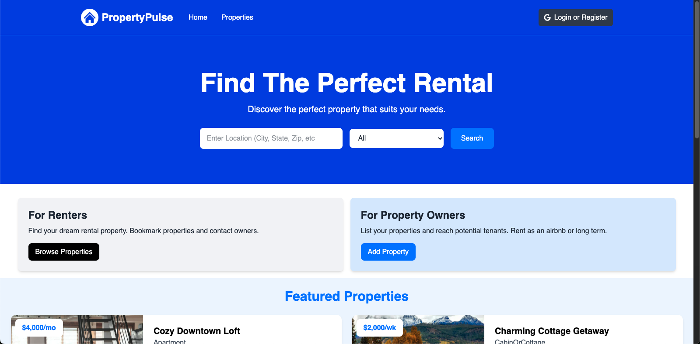
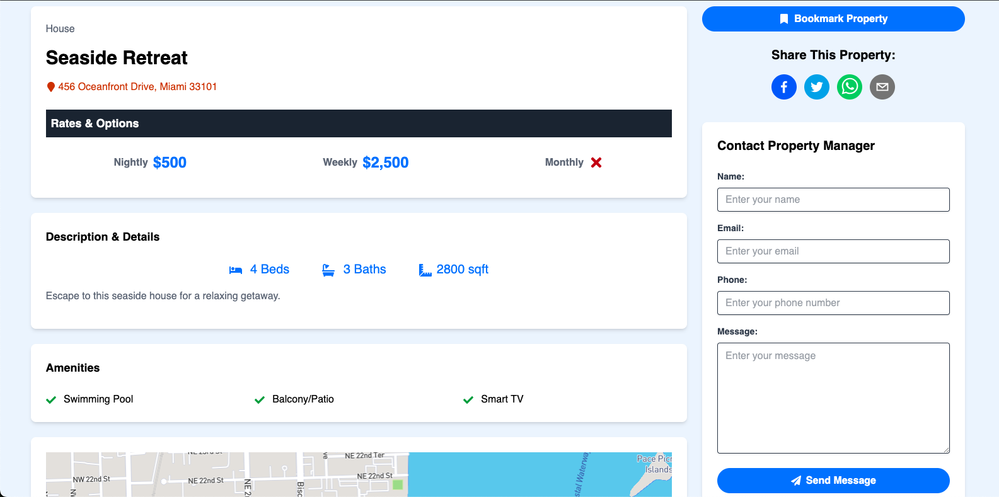
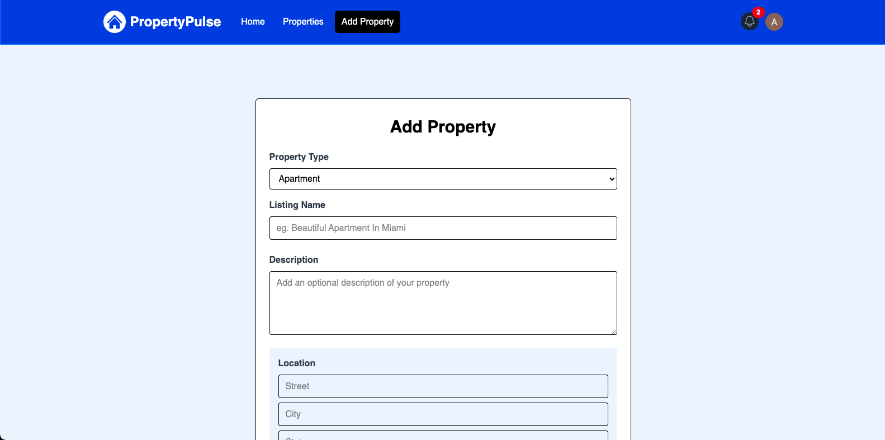
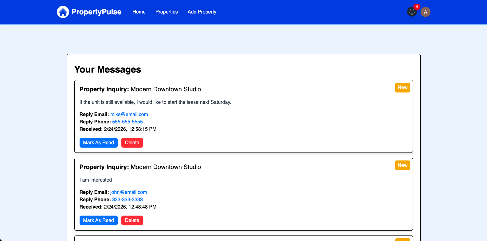

# Property Pulse

Property Pulse is a full-stack rental property marketplace built with Next.js that allows users to search, browse, bookmark, and manage rental listings. Authenticated users can add properties, upload images, contact property owners, and manage messages through an internal messaging system.

This project demonstrates modern full-stack architecture using Next.js App Router, server actions, OAuth authentication, and MongoDB.

---

## 🌐 Live Demo

🔗 https://property-pulse-app-three.vercel.app/

Demo account:
Sign in using Google OAuth

---

## 📸 Screenshots

Screenshots below show key user flows of the application.

### Home Page



### Property Detail Page



### Add Property



### Messages Page



---

## 🧩 Core Features

### 🌐 Property Discovery (Public)

- Search and browse listings
- View detailed property pages
- Interactive map integration
- Image gallery with lightbox
- Social sharing

### 🔐 User Account Features (Authenticated)

- Google OAuth authentication
- Add, edit, and delete listings
- Bookmark properties
- Saved properties page
- Messaging system with unread indicator

---

## 🔐 Authentication & Authorization

- Google OAuth via NextAuth
- Session management using SessionProvider
- Protected routes:
  - /properties/add
  - /profile
  - /properties/saved
  - /messages

---

## 🏗 Application Architecture & Data Flow

### Architecture Overview

Property Pulse is built as a full-stack Next.js App Router application where frontend and backend logic coexist within a unified framework.

The system follows a server-centric architecture leveraging Next.js Server Components and Server Actions:

- App Router for routing and layout composition
- Server Actions for backend logic and mutations
- Middleware for route protection
- MongoDB (Atlas) for persistence
- NextAuth (Google OAuth) for authentication

This structure enables secure, server-driven data mutations while keeping the client lightweight and focused on UI rendering.

### Data Modeling Strategy

The application uses a document-based schema design in MongoDB, modeling cross-collection relationships through referenced ObjectIds.

Core Models

- User – authentication data, saved properties, owned listings
- Property – listing details, owner reference, image URLs
- Message – sender, recipient, property reference, read status

Rather than embedding large subdocuments, relationships are handled through references to maintain document flexibility and support independent lifecycles (e.g., messages persist independently of property updates).

All data operations are validated and secured on the server to ensure only authorized users can access or modify information, and all data remains consistent.

### Server Action Flow

All mutations (add, update, delete, bookmark, message) follow a consistent pattern:

1. Establish database connection
2. Validate authenticated session (if required)
3. Execute MongoDB operation via Mongoose
4. Trigger revalidatePath, redirect, or return structured response data

This approach leverages Next.js caching and server-driven navigation to maintain UI consistency without excessive client-side state management.

---

## 🛠 Tech Stack

### Frontend

- Next.js 16 (App Router)
- React
- JavaScript
- Tailwind CSS
- React PhotoSwipe Gallery
- React Map GL
- React Geocode
- React Toastify
- React Share
- React Spinners
- React Icons

### Backend

- Next.js Server Actions
- NextAuth.js
- Mongoose
- MongoDB (Atlas)

### Third-Party Services

- Cloudinary (image storage)
- Mapbox + Google Geocoding API (maps)
- Google OAuth (NextAuth)

---

## 🔄 Example Feature Flow: Messaging System

1. User visits property detail page
2. Logged-in user submits contact form
3. Message is saved to database
4. Property owner sees unread message count in navbar
5. Owner can mark as read/unread or delete messages

This flow demonstrates session-based authorization, NoSQL schema design with referenced document relationships, and real-time UI state updates through server actions.

---

## ⚙️ Environment Variables

### Local development

Create a `.env` file in the project root:

```env
MONGODB_URI=<mongodb-uri>
NEXT_PUBLIC_DOMAIN=http://localhost:3000
NEXT_PUBLIC_API_DOMAIN=http://localhost:3000/api
GOOGLE_CLIENT_ID=<google-client-id>
GOOGLE_CLIENT_SECRET=<google-client-secret>
NEXTAUTH_URL=http://localhost:3000
NEXTAUTH_URL_INTERNAL=http://localhost:3000
NEXTAUTH_SECRET=<nextauth-secret>
CLOUDINARY_CLOUD_NAME=<cloudinary-cloud-name>
CLOUDINARY_API_KEY=<cloudinary-api-key>
CLOUDINARY_API_SECRET=<cloudinary-api-secret>
NEXT_PUBLIC_GOOGLE_GEOCODING_API_KEY=<google-geocoding-api-key>
NEXT_PUBLIC_MAPBOX_TOKEN=<mapbox-token>
```

### Deployment

The frontend is deployed on Vercel.

Environment variables should be configured in the Vercel Project Settings → Environment Variables.

```env
MONGODB_URI=<mongodb-uri>
NEXT_PUBLIC_DOMAIN=<your-production-domain>
NEXT_PUBLIC_API_DOMAIN=<your-production-domain>/api
GOOGLE_CLIENT_ID=<google-client-id>
GOOGLE_CLIENT_SECRET=<google-client-secret>
NEXTAUTH_URL=<your-production-domain>
NEXTAUTH_URL_INTERNAL=<your-production-domain>
NEXTAUTH_SECRET=<nextauth-secret>
CLOUDINARY_CLOUD_NAME=<cloudinary-cloud-name>
CLOUDINARY_API_KEY=<cloudinary-api-key>
CLOUDINARY_API_SECRET=<cloudinary-api-secret>
NEXT_PUBLIC_GOOGLE_GEOCODING_API_KEY=<google-geocoding-api-key>
NEXT_PUBLIC_MAPBOX_TOKEN=<mapbox-token>
```

---

## 🚀 Getting Started (Local Development)

### Prerequisites

- Node.js (v18+ recommended)
- npm (comes with Node.js)

### Setup

```bash
npm install
npm run dev
```

App runs at:

```bash
http://localhost:3000
```

---

## 🎯 What This Project Demonstrates

- Server-driven full-stack architecture with Next.js App Router
- OAuth authentication & protected routes
- NoSQL schema modeling with referenced document relationships
- Secure session-based authorization
- Cloud image storage integration (Cloudinary)
- Third-party API integration (Mapbox, Google APIs)
- Real-world messaging system design
- Responsive, production-ready UI with optimized server/client rendering
